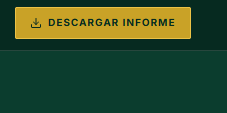
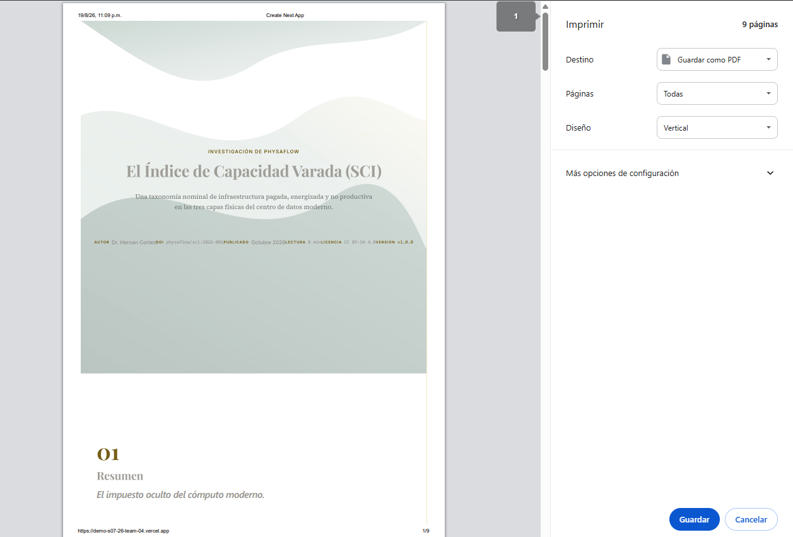

# 🐞 Reporte de Bug — BUG-01

## Botón 'Descargar informe' no descarga el archivo, abre el diálogo de Imprimir

| Campo | Detalle |
|---|---|
| **ID de bug** | BUG-01 |
| **Caso de prueba asociado** | TC-44 — Botón 'Descargar informe' (acción) |
| **Reportado por** | Andrés Adrian Estrada Uzeda (QA Engineer) |
| **Fecha** | 2026-08-19 |
| **Ambiente** | https://demo-s07-26-team-04.vercel.app/ |
| **Sprint** | Sprint 2 |
| **Módulo / Componente** | Descarga del informe (header) |
| **Severidad** | Alta |
| **Prioridad** | Alta |
| **Estado** | Abierto |

---

### Descripción

Al hacer clic en el botón **"DESCARGAR INFORME"** del header, el sitio no genera ni descarga un archivo del informe. En su lugar, dispara la función nativa de **Imprimir** del navegador, mostrando el diálogo del sistema con la opción "Guardar como PDF" en vez de resolverlo directamente como una descarga.

Esto contradice el entregable del brief: *"opción de descarga del informe completo"*, que se espera como una acción directa de descarga (no una impresión manual del usuario).

### Pasos para reproducir

1. Ingresar a https://demo-s07-26-team-04.vercel.app/
2. Ubicar el botón **"DESCARGAR INFORME"** en el header (ver *Evidencia 1*).
3. Hacer clic en el botón.
4. Observar el comportamiento del navegador.

### Resultado esperado

El sitio genera y descarga automáticamente el informe completo en un formato definitivo (PDF u otro), sin intervención manual del usuario ni diálogos del sistema operativo/navegador.

### Resultado actual

Se abre el diálogo nativo de **Imprimir** del navegador (*Evidencia 2*), mostrando una vista previa de 9 páginas del reporte "El Índice de Capacidad Varada (SCI)" con opciones de "Destino: Guardar como PDF", "Páginas: Todas" y "Diseño: Vertical". El usuario debe completar manualmente los pasos de impresión/guardado para obtener el archivo — no ocurre una descarga automática.

### Evidencia

**Evidencia 1 — Botón 'Descargar informe' en el header:**
`../evidencias/boton_imagen.png`

**Evidencia 2 — Diálogo de impresión del navegador en lugar de descarga:**
`../evidencias/menu_impresion.png`

### Impacto

- Rompe la expectativa de UX de un botón de descarga directa.
- Depende de la configuración del navegador del usuario (ej. si no tiene "Guardar como PDF" como destino, podría imprimir físicamente por error).
- Afecta un entregable explícito del brief del proyecto.

### Causa probable (a validar por Dev)

El botón probablemente está invocando `window.print()` en lugar de generar/servir un archivo (PDF estático, endpoint de generación de PDF, o link de descarga con atributo `download`).

### Sugerencia de solución

- Reemplazar la llamada a `window.print()` por la generación/entrega de un archivo real (por ejemplo, un PDF pre-generado servido con atributo `download`, o un endpoint que genere el PDF server-side con una librería como `puppeteer`/`react-pdf`).
- Validar que la descarga se dispare automáticamente al hacer clic, sin diálogos intermedios del sistema.

### Pasos de verificación (regresión)

- [ ] Clic en 'Descargar informe' inicia una descarga automática del archivo.
- [ ] El archivo descargado corresponde al informe completo y correcto.
- [ ] No se abre el diálogo de impresión del navegador.
- [ ] Repetir TC-44 y marcar como Aprobado tras la corrección.

---

